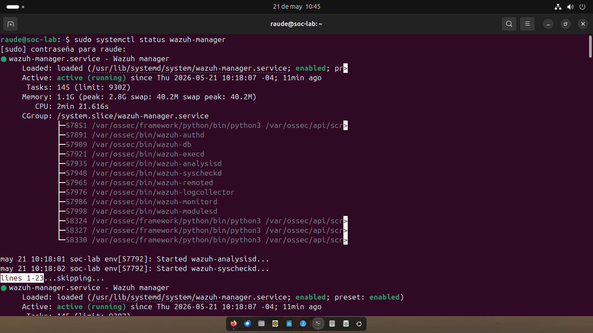
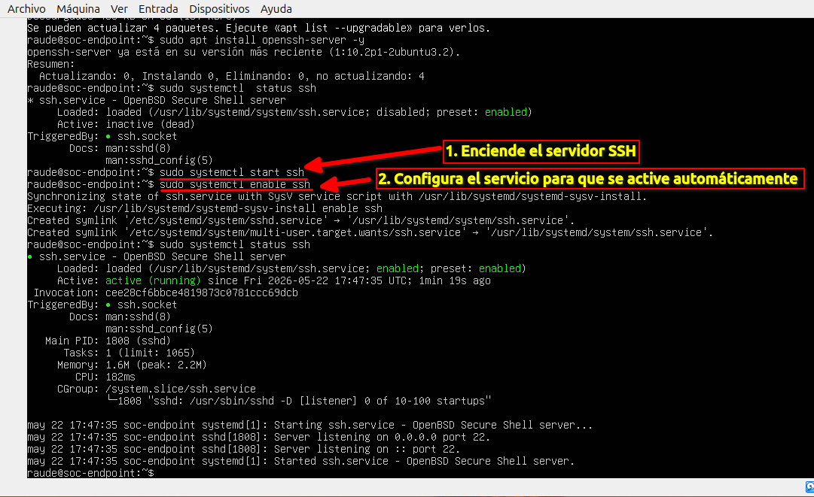

# Arquitectura del SOC Lab

## 1. Topología de Red
El laboratorio está compuesto por dos nodos principales conectados en una red local virtualizada.

- **Nodo Manager (Ubuntu Server):** - **IP:** 192.168.0.173
  - **Función:** Wazuh Manager, Servidor de Logs, Dashboard.
- **Nodo Agente (Ubuntu Server):**
  - **IP:** 192.168.0.xxx (Recuerda actualizar con la IP real)
  - **Función:** Endpoint de monitoreo y generación de eventos.

## 2. Validación de Conectividad
Se ha verificado la comunicación bidireccional entre el Nodo Manager y el Nodo Agente.

### Evidencia de Configuración

*Nodo Manager (Ubuntu): Comando `ip a`*

*Nodo Agente (Ubuntu): Comando `ip a`*

---

---

## 3. Despliegue de Wazuh Manager
Tras la configuración inicial de red, procedí con la instalación de Wazuh Manager y Dashboard. El sistema se encuentra operativo, con todos los servicios de análisis y correlación activos:

    
    

### Validación del Servicio (Backend)
Para confirmar la integridad del servicio a nivel de sistema, verifiqué el estado operativo del `wazuh-manager`:

*Descripción: Estado activo (running) del servicio wazuh-manager mediante systemctl.*
---

---

## 4. Gestión Remota (SSH)
Posterior a la instalación de Wazuh, configuré el acceso vía **SSH (Secure Shell)** para optimizar la gestión del laboratorio.

### Paso 1: Configuración del Servicio
Primero instalé y habilité el servicio SSH en el servidor Ubuntu para permitir conexiones seguras:

*Descripción: Instalación, inicio y habilitación del servicio SSH para persistencia en el arranque.*

### Paso 2: Acceso y Gestión
Una vez configurado, establecí la gestión remota desde mi terminal local:

*Descripción: Diferenciación visual entre mi PC Real (izquierda) y el servidor remoto (derecha) mediante perfiles de color.*
