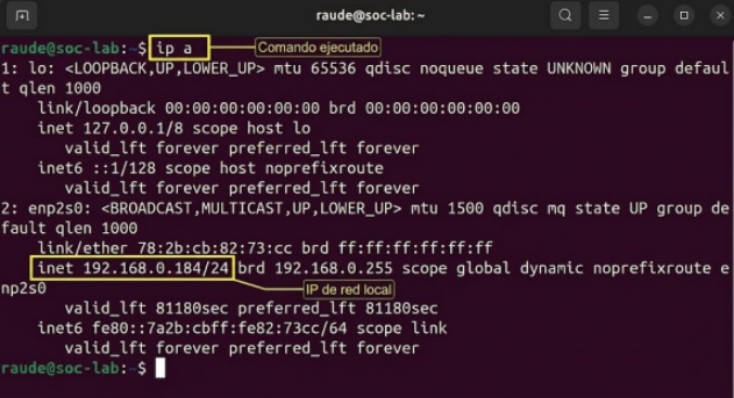

# Arquitectura del SOC Lab

## Topología de Red
El laboratorio está compuesto por dos nodos principales conectados en una red local virtualizada/física.

- **Nodo Manager (Ubuntu Server):** - IP:192.168.0.184
  - Función: Wazuh Manager, Servidor de Logs, Dashboard.
- **Nodo Agente (Windows 7):**
  - IP:162.168.0.188
  - Función: Endpoint de monitoreo y generación de eventos.

## Validación de Conectividad
Se ha verificado la comunicación bidireccional entre el Nodo Manager y el Nodo Agente mediante pruebas de ICMP (ping).

- **Estado:** Conexión establecida.
- **Evidencia:** Ver anexos de configuración de red.

### Evidencia de Red### 

### Evidencia de Configuración de Red

**Nodo Agente (Windows 7):**

**Nodo Manager (Ubuntu):**

