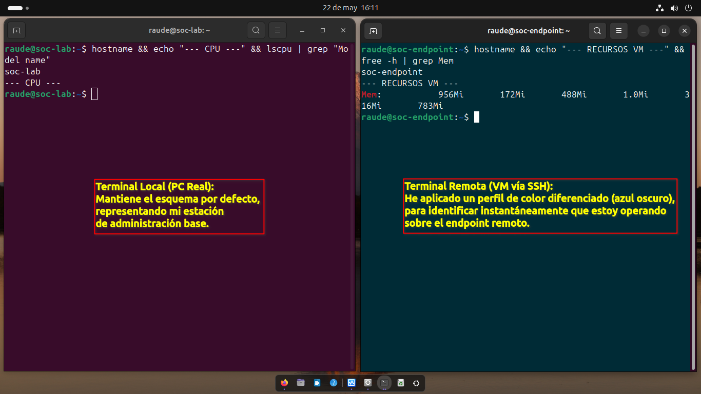
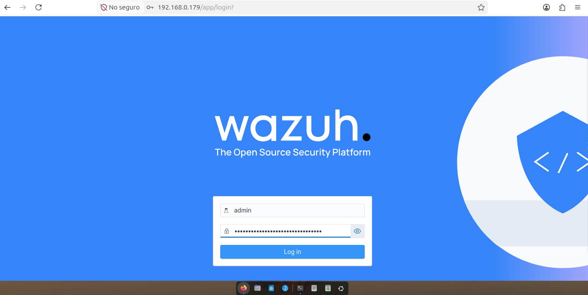
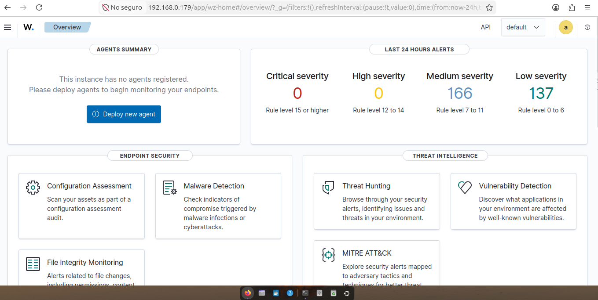

# Arquitectura del SOC Lab

## 1. Topología de Red
El laboratorio está compuesto por dos nodos principales conectados en una red local virtualizada/física.

- **Nodo Manager (Ubuntu Server):** - IP: 192.168.0.173
  - Función: Wazuh Manager, Servidor de Logs, Dashboard.
- **Nodo Agente (Ubuntu Server):**
  - IP: 192.168.0.173
  - Función: Endpoint de monitoreo y generación de eventos.

**Nota: Las direcciones IP asignadas son dinámicas (DHCP) y fueron validadas durante la configuración inicial de los equipos.**

## 2. Validación de Conectividad
Se ha verificado la comunicación bidireccional entre el Nodo Manager y el Nodo Agente.

### Evidencia de Configuración de Red

**Nodo Manager (Ubuntu):**

**Comando ejecutado:** `ip a`

**Resultado:** Interfaz activa con IP 192.168.0.173 asignada.

**Nodo Agente (Ubuntu Server):**
**Comando utilizado:** `ip a`
**Resultado:** Se confirma la asignación dinámica de la dirección IP.

---

## 3. Gestión Remota (SSH)
Para trabajar de forma profesional y evitar el uso constante de la interfaz gráfica de VirtualBox, he configurado acceso vía **SSH (Secure Shell)**. Esto me permite tomar el control total de la máquina virtual desde mi terminal local.

**Identificación Visual del Entorno:**
Para evitar errores operativos, he diferenciado mi entorno local de mi entorno remoto mediante perfiles de color en la terminal.

Descripción: Diferenciación visual entre mi PC Real (izquierda) y el servidor remoto (derecha).

---

<h2>Fase 2: Despliegue de Wazuh Manager</h2>

Se ha completado la instalación de Wazuh Manager y Dashboard en un entorno Ubuntu. 
A continuación se muestra la interfaz operativa del sistema:

    
    

<em>En estas capturas se observa el panel de control centralizado tras la finalización del asistente de instalación.</em>

